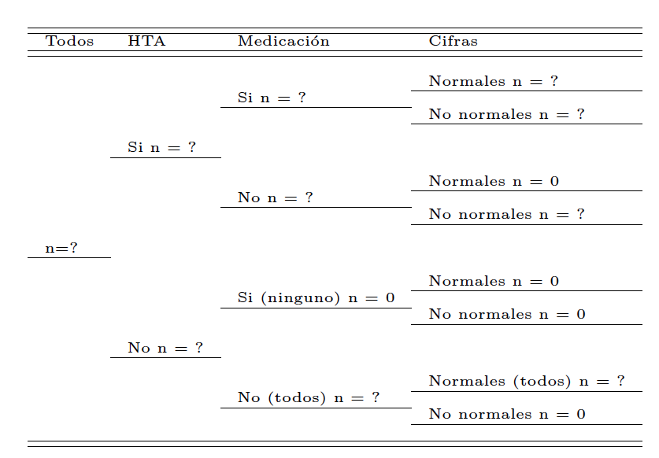

Question
========
```{r data generation, echo = FALSE, results = "hide"}
xn <- sample(seq(1400, 1500), 1)
hta <- round(xn*720/1500)
tx <- round(hta*180/720)
propnorm <- round(round(tx*sample(seq(0.38, 0.42,by = 0.001), 1))/tx, 3)
```
Se reclutaron `r xn` individuos seleccionados al azar de la provincia de Girona. Se consideraron hipertensos a los `r hta` individuos que presentaban alguna de las siguientes caracteríticas:

* cifras de tensión arterial sistólica (TAS) <span>&ge;</span>140 mm Hg 
* o tensión arterial diastólica (TAD ) <span>&ge;</span> 90 mm Hg  
* o tomaban medicación antihipertensiva. 

De los `r hta` hipertensos, `r tx` individuos tomaban medicación antihipertensiva y de estos el `r propnorm*100`% tenían cifras tensionales dentro de la normalidad.

Substituya los interrogantes de la siguiente tabla por el valor correcto (observe que cuando el valor es ``0'', ya se ha indicado).


```{r, echo=FALSE, results='hide'}
include_supplement("TablePreg4.png")
```

```{r, echo=FALSE, out.width="70%"}

```

¿Cuál de las siguientes respuestas es <font size="5"> **FALSA** </font>?

Answerlist
----------
* Los participantes No hipertensos eran `r xn` - `r tx`  = `r xn-tx`
* El porcentaje de No hipertensos es $\dfrac{`r (xn-hta)`}{`r xn`} * 100$ = `r format((xn-hta)/xn*100, digits = 1, nsmall = 1)`%
* Los Hipertensos que tomaban medicación y tenían cifras dentro de la normalidad eran `r tx` * `r propnorm` <span>&asymp;</span> `r round(tx*propnorm)` 
* El valor "q" (es decir, 1-p) de individuos que reciben tratamiento antihipertensivo es $1 - \dfrac{`r tx`}{`r xn`}$ = `r format(1-tx/xn, digits=3, nsmall=3)`
* El porcentaje de Hipertensos es $\dfrac{`r hta`}{`r xn`} * 100$= `r format(hta/xn*100, digits=1, nsmall=1)`%


Solution
========
* Para obtener los participantes no hipertensos:  `r xn` - `r hta` = `r xn-hta` 

* Todas las demás respuestas son correctas.

Answerlist
----------
* Respuesta FALSA
* Respuesta Correcta
* Respuesta Correcta
* Respuesta Correcta
* Respuesta Correcta


Meta-information
================
exname: Tipo Variables
extype: schoice
exsolution: 10000
exshuffle: 5
