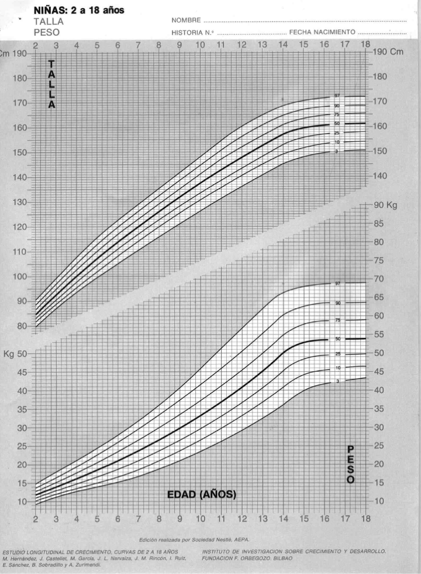

Question
========
Observe la figura que hay a continuación. Figuras como esta son ampliamente utilizadas en las consultas de pediatría ya que permite clasificar el percentil de peso y talla en el que se encuentra una niña entre los 2 y los 18 años (existen tablas parecidas para niños y para edades inferiores a los 2 años).
```{r, echo=FALSE, results='hide'}
include_supplement("PesTalla.png")
```

```{r, echo=FALSE, out.width="60%"}

```

```{r data generation, echo = FALSE, results = "hide", comment=FALSE}
options(OutDec=",")
ages <- c(7, 9, 11, 13, 15, 17)
heights <- c(1.10, 1.21, 1.31, 1.41, 1.48, 1.50)
weights <- c(24, 30, 37, 45, 53, 54)
mide90s <- c(1.26, 1.39, 1.51, 1.61, 1.68, 1.69)
pesoIdeals <- c(17, 21, 26, 32, 40, 43)
excesos <- weights - pesoIdeals

sce <- sample(seq(1, 6), 1)
age <- ages[sce]
height <- format(heights[sce], nsmall= 2)
weight <- weights[sce]
mide90 <- format(mide90s[sce], nsmall=2)
pesoIdeal <- pesoIdeals[sce]
exceso <- excesos[sce]
figresu <- paste("sce", sce, ".png", sep="")
``` 

Una niña de `r age` años pesa `r weight` kg. y mide `r  height` m. Utilizando la figura anterior ¿Cuál de las siguientes respuestas es <font size="5"> **FALSA** </font>?


Answerlist
----------
* De acuerdo con la figura a los `r age`  años el 90\% de la niñas mide `r mide90` m o más 
* De acuerdo con la figura, el 97\% de las niñas de su edad miden más que ella
* De acuerdo con su talla esta niña debería pesar aproximadamente `r pesoIdeal` kg
* De acuerdo con la figura, el 50\% de las niñas de su edad pesan `r weight` kg o más
* Esta niña pesa unos `r exceso` kg más de lo que debería según su talla. Se debería investigar la causa de este problema de exceso de peso.


Solution
========
En la siguiente figura se ha señalado donde se sitúan los parámetros de esta niña:
```{r, echo=FALSE, results='hide'}
include_supplement(figresu)
```
```{r, echo=FALSE, out.width="40%"}
knitr::include_graphics(figresu)
```

Claramente está en el percentil:

* 10 de Talla
* 50 de Peso

Su altura es pequeña (percentil-10) por lo que en una situación de “peso ideal”, su peso debería estar también en el percentil 10, es decir `r pesoIdeal` kg. Por lo tanto, tiene un exceso de peso de `r pesoIdeal` - `r weight`  = `r exceso`.

El percentil 90 para una niña de `r age` años se sitúa en `r mide90`. Por lo tanto, a los `r age` años un 90% mide `r mide90` o **<span style="color: red;">MENOS</span>** y un 10% o **MÁS**


 
Answerlist
----------
* Respuesta FALSA
* Respuesta Correcta
* Respuesta Correcta
* Respuesta Correcta
* Respuesta Correcta


Meta-information
================
exname: Percentiles
extype: schoice
exsolution: 10000
exshuffle: 5
