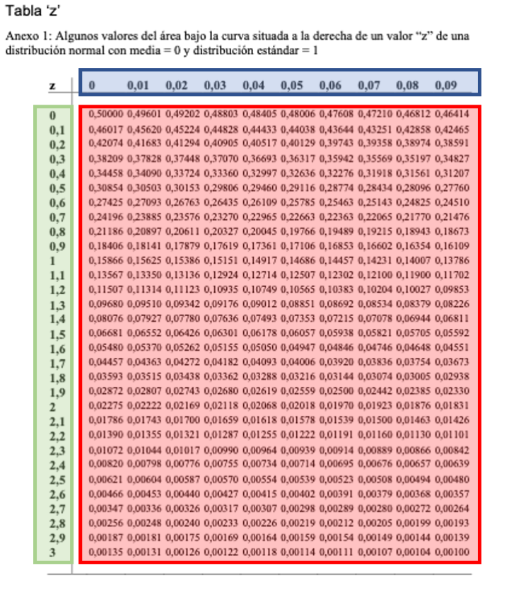

Question
========
```{r data generation, echo = FALSE, results = "hide", comment=FALSE}
options(OutDec=",")
source("/Users/jvila/Dropbox/euit/common/exerc/examsEUIT/simulV02.r")
options(scipen=999)
a1 <- sample(seq(0.4, 0.48, 0.01), 1)
zright1 <- abs(round(qnorm(a1), 2))
xzright1 <- abs(round(qnorm(a1/2), 2))
pright1 <- round(1-pnorm(zright1), 5)

a2 <- sample(seq(1.60, 1.80, 0.01), 1)
pright2 <- round(1-pnorm(a2), 5)

a3 <- sample(seq(-1.25, -1.01, 0.01), 1)
pleft3 <- round(pnorm(a3), 5)

a4 <- sample(seq(1.15, 1.40, 0.01), 1)
pmid4 <- round(1-((1-pnorm(a4))*2), 5)

a5 <- sample(seq(0.3, 0.4, 0.01), 1)
zleft5 <- qnorm(a5)

mydat <- data.frame(z=seq(0, 3, 0.01))

mydat$z <- round(mydat$z, 2)

mydat$prop <- round(1-pnorm(mydat$z), 5)

mydat$id <- as.numeric(rownames(mydat))
source("/Users/jvila/Dropbox/euit/common/exerc/examsEUIT/DrawNormalCurves.R")
```
En una variable estandarizada que siguiera una distribución normal, ¿Cuál de las siguientes respuestas es <font size="5"> **FALSA**</font>?

Answerlist
----------
* El valor de *z* que deja por encima el `r format(round(pright1*100, 1),digits = 1, nsmall = 1)`% de valores es = `r xzright1`
* La proporción de individuos presentaría valores <span>&ge;</span> `r a2` es = `r pright2`
* La proporción de individuos presentaría valores <span>&le;</span> `r a3` es = `r pleft3`
* La porcentaje de individuos presentaría valores <span>&ge;</span> `r -a4` y <span>&le;</span> `r a4` es = `r format(round(pmid4*100, 1),digits = 1, nsmall = 1)`% 
* El valor de *z* que deja por debajo el `r format(round(a5*100, 1),digits = 1, nsmall = 1)`% de valores es = `r format(round(zleft5, 2),digits = 2, nsmall = 2)`


Solution
========
La siguiente tabla de la distribución normal consta de unos **valores internos** (sombreados en color rojo) y unos **valores externos** (sombreados en color verde la columna y en color azul la fila). 

```{r, echo=FALSE, results='hide'}
library(exams)
include_supplement("TaulaNormal.png")
```

```{r, echo=FALSE, out.width="60%"}

```
```{r, echo=FALSE, results='hide'}
xid <- subset(mydat, prop ==pright1)$id
subdat <- subset(mydat, id%in%c(xid-1, xid, xid+1))
subdat$diff <- with(subdat, abs(prop- round(pright1, 3)))
```


Para responder si es falsa la respuesta "El valor de *z* que deja por encima el `r format(round(pright1*100, 1),digits = 1, nsmall = 1)`% de valores es = `r xzright1`", se debe buscar ***dentro*** la tabla (en la zona de color rojo) el que más se acerque a `r format(round(pright1*100, 1),digits = 1, nsmall = 1)`% expresado en proporción, es decir el que más se acerque a  `r round(pright1, 3)`.

Se tiene que seleccionar un solo valor, pero para evitar dudas, a continuación se seleccionan los tres valores que más se acercan, que son: `r subdat$prop[1]`, `r subdat$prop[2]` y `r subdat$prop[3]`. Entre estos tres valores elige el más cercano a `r round(pright1, 3)`, concretamente:

* |`r round(pright1, 3)` - `r subdat$prop[1]`| = `r subdat$diff[1]`

* |`r round(pright1, 3)` - `r subdat$prop[2]`| = `r subdat$diff[2]`

* |`r round(pright1, 3)` - `r subdat$prop[3]`| = `r subdat$diff[3]`


El más cercano es `r subset(mydat, id ==xid)$prop`. 

Ahora observe que en la fila donde se halla el valor `r subset(mydat, id ==xid)$prop`, en la columna de la izquierda (la marcada en color verde) hay el valor **<span style="color: green;">`r trunc(mydat[xid, ]$z*10)/10`</span>** y que en la columna donde se halla el valor `r subset(mydat, id ==xid)$prop`, en la fila de arriba (la marcada en color azul) hay el valor **<span style="color: blue;">`r format(mydat[xid, ]$z - trunc(mydat[xid, ]$z*10)/10, digits = 2, nsmall = 2)`</span>**.

Sumando ambos valores **<span style="color: green;">`r trunc(mydat[xid, ]$z*10)/10`</span>** + **<span style="color: blue;">`r format(mydat[xid, ]$z - trunc(mydat[xid, ]$z*10)/10, digits = 2, nsmall = 2)`</span>** = `r mydat[xid, ]$z`. 

Por lo tanto esta respuesta es FALSA. 

En la siguiente figura se ha sombreado la área sobre la que se está preguntando.

```{r boxplot, echo = FALSE, results = "hide", fig.height = 4, fig.width = 5, fig.path = "", fig.cap = ""}
xstart <- abs(round(qnorm(subset(mydat, id ==xid)$prop), 2))
OneArea(xstart = xstart, xend = 3, xmean=0, ee = 1, xcolor= "red")
arrows(-2.5,mean(y),xstart, -y[480])
text(-2.5, mean(y)+y[400], paste("z = ", zright1, sep =""))

```

En esta figura, la zona marcada con color rojo se corresponde al `r subset(mydat, id ==xid)$prop` * 100 = `r format(round(subset(mydat, id ==xid)$prop*100, 1), nsmall= 1, digits= 1)`% de toda la área bajo la curva. 

<br>     

------

Para saber si es correcto que la proporción de individuos presentaría valores <span>&ge;</span> `r a2` es = `r pright2`, se debe buscar el valor **<span style="color: green;">`r round(trunc(a2*10), 1)/10`</span>** en la columna de color verde, y el valor **<span style="color: blue;">`r format(a2 - round(trunc(a2*10), 1)/10, digits=2, nsmall= 2)`</span>** en la fila de color azul. 

Observando la zona sobreada en color rojo, donde confluyen los valores **<span style="color: green;">`r round(trunc(a2*10), 1)/10`</span>**  y **<span style="color: blue;">`r format(a2 - round(trunc(a2*10), 1)/10, digits=2, nsmall= 2)`</span>**, observe que hay el valor `r pright2`. 

En la siguiente figura se ha sombreado la área sobre la que se está preguntando.


```{r  echo = FALSE, results = "hide", fig.height = 4, fig.width = 5, fig.path = "", fig.cap = ""}
xstart <- a2
OneArea(xstart = xstart, xend = 3, xmean=0, ee = 1, xcolor= "red")
arrows(-2.5,mean(y),xstart, -y[480])
text(-2.5, mean(y)+y[400], paste("z = ", a2, sep =""))

```

En esta figura, la zona marcada con color rojo se corresponde al `r pright2` * 100 = `r format(round(pright2*100, 1), nsmall= 2, digits= 2)`% de toda la área bajo la curva. 

<br>     

------

Para saber si es correcto que la proporción de individuos presentaría valores <span>&le;</span> `r a3` es = `r pleft3`, se debe buscar el valor **<span style="color: green;">`r abs(round(trunc(a3*10), 1)/10)`</span>** en la columna de color verde, y el valor **<span style="color: blue;">`r format(abs(a3 - round(trunc(a3*10), 1)/10), digits=2, nsmall= 2)`</span>** en la fila de color azul. 

Donde confluyen ambos valores, en la zona roja, observe que hay el valor `r pleft3`. 

En la siguiente figura se ha sombreado la área sobre la que se está preguntando.

```{r  echo = FALSE, results = "hide", fig.height = 4, fig.width = 5, fig.path = "", fig.cap = ""}
xstart <- -3
OneArea(xstart = xstart, xend = a3, xmean=0, ee = 1, xcolor= "red")
arrows(-2.5,mean(y), a3, -y[50])
text(-2.5, mean(y) + y[150], paste("z = ", a3, sep =""))
```

En esta figura, la zona marcada con color rojo se corresponde al `r pleft3` * 100 = `r format(round(pleft3*100, 1), nsmall= 1, digits= 1)`% de toda la área bajo la curva. 

<br>     

------

Para saber que si el porcentaje de individuos presentaría valores <span>&ge;</span> `r -a4` y <span>&le;</span> `r a4` es = `r format(round(pmid4*100, 1),digits = 1, nsmall = 1)`%  se debe buscar el valor **<span style="color: green;">`r round(trunc(a4*10), 1)/10`</span>** en la columna de color verde, y el valor **<span style="color: blue;">`r format(a4 - round(trunc(a4*10), 1)/10, digits=2, nsmall= 2)`</span>** en la fila de color azul. 

Donde confluyen ambos valores, en la zona roja, observe que hay el valor `r format(round(1-pnorm(a4), 5), digits=5, nsmall=5)`. 

Por lo tanto la proporción de área bajo la curva que queda:

* a la izquierda del valor `r -a4` es `r format(round(1-pnorm(a4), 5), digits=5, nsmall=5)`

* a la derecha del valor +`r a4` es `r format(round(1-pnorm(a4), 5), digits=5, nsmall=5)`

Entre ambos valores se halla 1 - `r format(round(1-pnorm(a4), 5), digits=5, nsmall=5)` - `r format(round(1-pnorm(a4), 5), digits=5, nsmall=5)` = `r pmid4`, que expresado en porcentaje = `r format(round(pmid4*100, 1),digits = 1, nsmall = 1)`% 

En la siguiente figura se ha sombreado la área sobre la que se está preguntando.

```{r  echo = FALSE, results = "hide", fig.height = 4, fig.width = 5, fig.path = "", fig.cap = ""}
xstart <- -a4
OneArea(xstart = xstart, xend = a4, xmean=0, ee = 1, xcolor= "red")
arrows(-2.5,mean(y),xstart, -y[2]*0.03)
text(-2.5, mean(y)+y[2]*0.10, paste("z = ", -a4, sep =""))
arrows(+2.5,mean(y),-xstart, -y[2]*0.03)
text(+2.5, mean(y)+y[2]*0.10, paste("z = +", a4, sep =""))
```

En esta figura, la zona marcada con color rojo se corresponde al `r format(round(pmid4*100, 1),digits = 1, nsmall = 1)`% de toda la área bajo la curva. 

<br> 

------
```{r, echo=FALSE, results='hide'}
xid2 <- subset(mydat, z==abs(round(zleft5, 2)))$id
subdat2 <- subset(mydat, id%in%c(xid2-1, xid2, xid2+1))
subdat2$diff <- with(subdat2, abs(prop- a5))

```

Para saber que si el valor de *z* que deja por debajo el `r format(round(a5*100, 1),digits = 1, nsmall = 1)`% de valores es = `r format(round(zleft5, 2),digits = 2, nsmall = 2)`, se  se debe buscar ***dentro*** la tabla (en la zona de color rojo) el que más se acerque a `r format(round(a5*100, 1),digits = 1, nsmall = 1)`% expresado en proporción, es decir el que más se acerque a  `r round(a5, 3)`.

Se tiene que seleccionar un solo valor, pero para evitar dudas, a continuación se seleccionan los tres valores que más se acercan son: `r subdat2$prop[1]`, `r subdat2$prop[2]` y `r subdat2$prop[3]`. Entre estos tres valores se debe elegir el más cercano a `r a5`, concretamente:

* |`r a5` - `r subdat2$prop[1]`| = `r subdat2$diff[1]`

* |`r a5` - `r subdat2$prop[2]`| = `r subdat2$diff[2]`

* |`r a5` - `r subdat2$prop[3]`| = `r subdat2$diff[3]`


El mas cercano es `r subset(mydat, id ==xid2)$prop`. 

Ahora observe que en la fila donde se halla el valor `r subset(mydat, id ==xid2)$prop`, en la columna de la izquierda (la marcada en color verde) hay el valor **<span style="color: green;">`r trunc(mydat[xid2, ]$z*10)/10`</span>** y que en la columna donde se halla el valor `r subset(mydat, id ==xid2)$prop`, en la fila de arriba (la marcada en color azul) hay el valor **<span style="color: blue;">`r format(mydat[xid2, ]$z - trunc(mydat[xid2, ]$z*10)/10, digits = 2, nsmall = 2)`</span>**.

Sumando ambos valores **<span style="color: green;">`r trunc(mydat[xid2, ]$z*10)/10`</span>** + **<span style="color: blue;">`r format(mydat[xid2, ]$z - trunc(mydat[xid2, ]$z*10)/10, digits = 2, nsmall = 2)`</span>** = `r mydat[xid2, ]$z`. 

Por lo tanto esta respuesta es Correcta. 

En la siguiente figura se ha sombreado la área sobre la que se está preguntando.

```{r  echo = FALSE, results = "hide", fig.height = 4, fig.width = 5, fig.path = "", fig.cap = ""}
xstart <- -3
OneArea(xstart = xstart, xend = round(qnorm(subset(mydat, id ==xid2)$prop), 2), xmean=0, ee = 1, xcolor= "red")
arrows(+2.5,mean(y),round(qnorm(subset(mydat, id ==xid2)$prop), 2), -y[2]*1.50)
text(+2.5, mean(y)+y[100], paste("z = ",  round(qnorm(subset(mydat, id ==xid2)$prop), 2), sep =""))

```

En esta figura, la zona marcada con color rojo se corresponde al `r a5` * 100 = `r format(round(a5*100, 1), nsmall= 1, digits= 1)`% de toda la área bajo la curva. 

<br>     


Answerlist
----------
* Respuesta FALSA
* Respuesta Correcta
* Respuesta Correcta
* Respuesta Correcta
* Respuesta Correcta


Meta-information
================
exname: CoefVar
extype: schoice
exsolution: 10000
exshuffle: 5
