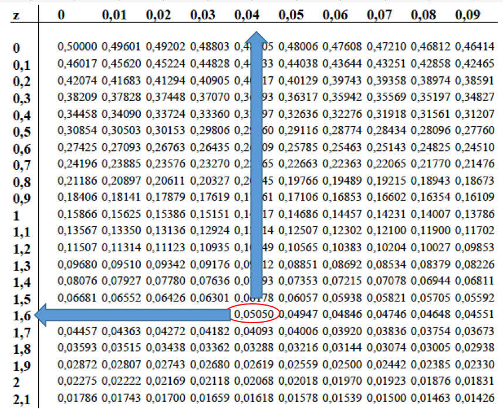
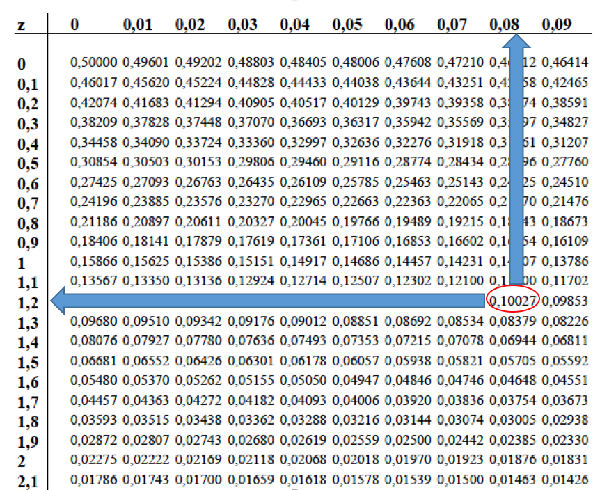
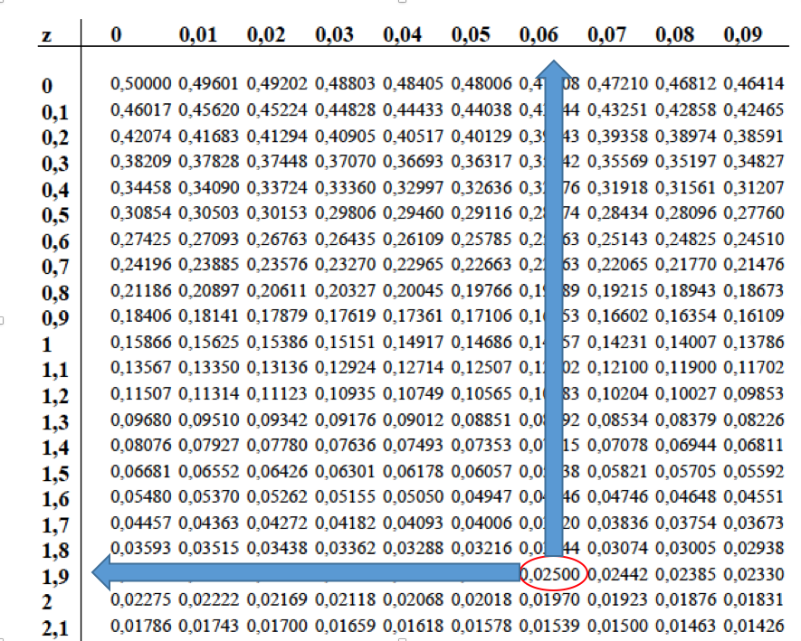

Question
========
```{r data generation, echo = FALSE, results = "hide", comment=FALSE}
options(OutDec=",")
options(scipen=999)
xmean <- sample(seq(180, 220, 0.1), 1)
xsd <- round(xmean*0.23, 1)
xi <- sample(seq(xmean, 220, 0.1), 1)
x90lo <- round(-1.64 * xsd + xmean, 1)
x90up <- round(1.64 * xsd + xmean, 1)
x95lo <- round(-1.96 * xsd + xmean, 1)
x95up <- round(1.96 * xsd + xmean, 1)
x80lo <- round(-1.28 * xsd + xmean, 1)
x80up <- round(1.28 * xsd + xmean, 1)
y80lo <- round(-0.84 * xsd + xmean, 1)
y80up <- round(0.84 * xsd + xmean, 1)


in90 <- round(sample(seq(x90lo, x90up), 1))
sup90 <- ceiling(x90up*1.05)
inf90 <- floor(x90lo*0.95)
```
Suponga que se ha medio el colesterol a miles de personas. Estos valores siguen una distribución normal con media `r xmean` mg/dL y desviación estándar `r xsd` mg/dL. 

Para calcular los **límites de referencia**, se decide calcular los valores que incluyen en el centro al 90% de colesterol, y considerar valores fuera del intervalo de referencia el 5% de valores más pequeños y el 5% más grandes.

La tabla de la distribución normal muestra, que si se estandariza, el 5% de valores serán <span>&ge;</span> a 1,64. En la siguiente figura se muestra gráficamente esta explicación. 

```{r, echo=FALSE, results='hide'}
library(exams)
include_supplement("x164.png")
```

```{r, echo=FALSE, out.width="60%"}

```

Por lo tanto, en los valores de colesterol, el valor que estandarizado que sea <span>&ge;</span> 1,64, será el valor que dejará por encima el 5% de valores. Este valor es:

$1,64 = \dfrac{x_i - `r xmean`}{`r xsd`}  \qquad \therefore \qquad x_i = 1,64 * `r xsd` + `r xmean` = `r x90up`$

<br>

Similarmente, el valor estandarizado "-1,64" dejará por debajo el 5% de valores:

$-1,64 = \dfrac{x_i - `r xmean`}{`r xsd`}  \qquad \therefore \qquad x_i = (-1,64) * `r xsd` + `r xmean` = `r x90lo`$


Por lo tanto entre los valores `r x90lo` y `r x90up` se encontrarán el 90% central de los valores. Estos son los **límites de referencia**, si se quiere indicar como valores bajo o altos los que estén fuera del intervalo del 90%. 

De acuerdo con esta explicación: ¿Cuál de las siguientes respuestas es <font size="5"> **FALSA**</font>?

Answerlist
----------
* Si en lugar de considerar como referencia el 90% central, se hubiera querido considerar el 80% central, el intervalo de referencia sería entre `r y80lo` y `r y80up` 
* Un individuo que tenga un valor de `r in90` estará dentro del intervalo de referencia
* Un individuo que tenga un valor de `r sup90`  estará fuera del intervalo de referencia y se considerará alto
* Un individuo que tenga un valor de `r inf90`  estará fuera del intervalo de referencia y se considerará bajo
* Si en lugar de considerar como referencia el 90% central, se hubiera querido considerar el 95% central, in intervalo de referencia sería entre `r x95lo` y `r x95up`


Solution
========
Para responder a la pregunta de si en lugar de considerar como referencia el 90% central, se hubiera querido considerar el 80% central, el intervalo de referencia sería entre `r y80lo` y `r y80up`:

El valor estandarizado que deja por encima en 10,0% es 1,28. Por lo tanto entre -1,28 y +1,28 se hallará el 80% de los valores (ver figura siguiente)

```{r, echo=FALSE, results='hide'}
include_supplement("x128.png")
```

```{r, echo=FALSE, out.width="60%"}

```


Por lo tanto el 80% central de los valores se encontrarán entre: 

Límite inferior = $(-1,28) * `r xsd` + `r xmean` = `r x80lo` \qquad \therefore \qquad$ Límite superior  = $(+1,28) * `r xsd` + `r xmean` = `r x80up`$

<br>

------

Para responder a la pregunta de si un individuo que tenga un valor de `r in90` estará dentro del intervalo de referencia:

El valor `r in90` se haya entre `r x90lo` y `r x90up`, por lo tanto se haya dentro del **intervalo de referencia**.

<br>

------

Para responder a la pregunta de si un individuo que tenga un valor de `r sup90`  estará fuera del intervalo de referencia y se considerará alto:

El valor `r sup90` está por encima del límite superior del intervalo (`r x90up`), por lo tanto se considerará alto.

<br> 

------

Para responder a la pregunta de si un individuo que tenga un valor de `r inf90`  estará fuera del intervalo de referencia y se considerará bajo:

El valor `r inf90` está por debajo del límite inferior del intervalo (`r x90lo`), por lo tanto se considerará bajo.

<br>

------

Para responder a la pregunta de si en lugar de considerar como referencia el 90% central, se hubiera querido considerar el 95% central, in intervalo de referencia sería entre `r x95lo` y `r x95up`:

El valor estandarizado que deja por encima en 2,5% es 1,96. Por lo tanto entre -1,96 y +1,96 se hallará el 95% de los valores (ver figura a continuación)

```{r, echo=FALSE, results='hide'}
include_supplement("x196.png")
```

```{r, echo=FALSE, out.width="60%"}

```

Por lo tanto el 95% central de los valores se encontrarán entre: 

Límite inferior = $(-1,96) * `r xsd` + `r xmean` = `r x95lo` \qquad \therefore \qquad$ Límite superior = $(+1,96) * `r xsd` + `r xmean` = `r x95up`$ 

<br>

<br>


Answerlist
----------
* Respuesta FALSA
* Respuesta Correcta
* Respuesta Correcta
* Respuesta Correcta
* Respuesta Correcta


Meta-information
================
exname: Normal
extype: schoice
exsolution: 10000
exshuffle: 5
