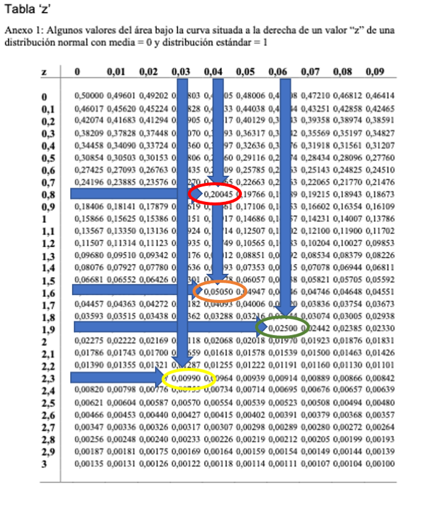

Question
========
```{r data generation, echo = FALSE, results = "hide", comment=FALSE}
options(OutDec=",")
options(scipen=999)
source("/Users/jvila/Dropbox/euit/common/exerc/examsEUIT/DrawNormalCurves.R")

xmean <- sample(seq(110, 150), 1)
xsd <- round(xmean*0.15, 1)

xunder95 <- round(xmean+1.96*xsd)
under95  <- round(xmean+1.64*xsd)
lo90mid  <- round(xmean-1.64*xsd)
up90mid  <- round(xmean+1.64*xsd)
over99   <- round(xmean-2.33*xsd)
lo95mid  <- round(xmean-1.96*xsd)
up95mid  <- round(xmean+1.96*xsd)
over20   <- round(xmean+0.84*xsd)
```

Suponga que una variable sigue una distribución normal con media `r xmean` y desviación estándar de `r xsd` ¿Cuál de las siguientes respuestas es <font size="5"> **FALSA**</font>?


Answerlist
----------
* El punto de corte que deja por debajo el 95% de valores es `r xunder95`
* El 90% central de los valores de esta variable se encontrarán entre `r lo90mid` y `r up90mid`
* El punto de corte que deja por encima el 99% de valores es `r over99`
* El 95% central de los valores de esta variable se encontrarán entre `r lo95mid` y `r up95mid`
* El punto de corte que deja por encima el 20% de valores es `r over20`


Solution
========
Observe la siguiente tabla de la distribución normal:
```{r, echo=FALSE, results='hide'}
include_supplement("NormalP18.png")
```

```{r, echo=FALSE, out.width="60%"}

```

En esta tabla se han señalado 4 valores:

* <span style="background-color: red">**en color rojo**</span> 0,20045 ($\approx  20\%$), que se corresponde con un valor de **z** = 0,84

* <span style="background-color: orange">**en color naranja**</span> 0,05050 ($\approx  5\%$), que se corresponde con un valor de **z** = 1,64

* <span style="background-color: green">**en color verde**</span> 0,02500 ($\approx  2,5\%$), que se corresponde con un valor de **z** = 1,96

* <span style="background-color: yellow">**en color amarillo**</span> 0.00990 ($\approx  0,1\%$), que se corresponde con un valor de **z** = 2,33

<br>

-------

Para saber si es correcta la respuesta de que "El punto de corte que deja por debajo el 95% de valores es `r xunder95`":

```{r  echo = FALSE, results = "hide", fig.height = 4, fig.width = 5, fig.path = "", fig.cap = ""}
xstart <- -3
OneArea(xstart = xstart, xend = 1.64, xmean=0, ee = 1, xcolor= "red")
arrows(+2.5,mean(y),1.64, -y[010])
text(+2.5, mean(y)+y[80], paste("z = ", 1.64, sep =""))
```

Según esta figura el 5% de los valores de una variable estandarizada ($\overline{X}= 0 \therefore DE = 1$) se encontrarían a la derecha del valor 1,64 es decir serían <span>&ge;</span> 1,64, por lo tanto a la izquierda del valor 1,64 quedarían el 95% de valores, es decir el 95% de los valores serían <span>&le;</span> 1,64. 

Si la variable no estubiera estandarizada y $\overline{X}= `r xmean` \therefore DE = `r xsd`$ se trata de despejar $x_i$ en la siguiente ecuación:

$z= \dfrac{x_i -\overline{X} }{DE}$ = $1,64 = \dfrac{x_i - `r xmean`}{`r xsd`} \qquad \therefore \qquad x_i = (1.64 * `r xsd`) + `r xmean` \approx `r under95`$

El 95% de los valores serían <span>&le;</span> `r under95` y no <span>&le;</span> `r xunder95` como dice el enunciado. Por tanto la respuesta es **FALSA**.


-------


Para saber si es correcta la respuesta de que "El 90% central de los valores de esta variable se encontrarán entre `r lo90mid` y `r up90mid`":

```{r boxplot, echo = FALSE, results = "hide", fig.height = 4, fig.width = 5, fig.path = "", fig.cap = ""}
xstart <- -1.64
OneArea(xstart = xstart, xend = 1.64, xmean=0, ee = 1, xcolor= "red")
arrows(+2.5,mean(y),1.64, -y[2]*0.05)
text(+2.5, mean(y)+y[2]*0.15, paste("z = ", 1.64, sep =""))
arrows(-2.5,mean(y),-1.64, -y[2]*0.05)
text(-2.5, mean(y)+y[2]*0.15, paste("z = ", -1.64, sep =""))
```

Según esta figura el 5% de los valores de una variable estandarizada ($\overline{X}= 0 \therefore DE = 1$) se encontrarían a la derecha del valor +1,64, es decir serían <span>&ge;</span> +1,64. 


Similarmente el 5% de los valores de una variable estandarizada ($\overline{X}= 0 \therefore DE = 1$) se encontrarían a la izquierda del valor -1,64, es decir serían <span>&le;</span> -1,64. 

Por lo tanto entre 1,64 y +1,64 se hallaría el 90% de los valores. 

Para saber el límite superior si la variable no estubiera estandarizada y $\overline{X}= `r xmean` \therefore DE = `r xsd`$ se trata de despejar $x_i$ en la siguiente ecuación:

$z= \dfrac{x_i -\overline{X} }{DE}$ = $1,64 = \dfrac{x_i - `r xmean`}{`r xsd`} \qquad \therefore \qquad x_i = (1.64 * `r xsd`) + `r xmean` \approx `r up90mid`$

El 5% de los valores serían <span>&ge;</span> `r up90mid`. 

Similarmente para saber el límite inferior si la variable no estubiera estandarizada y $\overline{X}= `r xmean` \therefore DE = `r xsd`$ se trata de despejar $x_i$ en la siguiente ecuación:

$z= \dfrac{x_i -\overline{X} }{DE}$ = $-1,64 = \dfrac{x_i - `r xmean`}{`r xsd`} \qquad \therefore \qquad x_i = (-1,64 * `r xsd`) + `r xmean` \approx `r lo90mid`$

El 5% de los valores serían <span>&le;</span> `r lo90mid`. 

Por lo tanto entre `r lo90mid` y `r up90mid` se hallarían el 90% de los valores no estandarizados.


-------

Para saber si es correcta la respuesta de que "El punto de corte que deja por encima el 99% de valores es `r over99`":

```{r  echo = FALSE, results = "hide", fig.height = 4, fig.width = 5, fig.path = "", fig.cap = ""}
xstart <- -2.33
OneArea(xstart = xstart, xend = 3, xmean=0, ee = 1, xcolor= "red")
arrows(-2.5,mean(y),-2.33, -y[2]*0.05)
text(-2.5, mean(y)+y[2]*0.5, paste("z = ", -2.33, sep =""))
```

Según esta figura el 1% de los valores de una variable estandarizada ($\overline{X}= 0 \therefore DE = 1$) se encontrarían a la izquierda del valor -2.33 y por lo tanto el 99% serían <span>&ge;</span> -2.33.

Para saber a que valor corresponde en valor estandarizado de -2,33 a una variable que no estubiera estandarizada y $\overline{X}= `r xmean` \therefore DE = `r xsd`$ se trata de despejar $x_i$ en la siguiente ecuación:

$z= \dfrac{x_i -\overline{X} }{DE}$ = $2,33 = \dfrac{x_i - `r xmean`}{`r xsd`} \qquad \therefore \qquad x_i = (-2,33 * `r xsd`) + `r xmean` \approx `r over99`$

Por lo tanto en una variable que siga una distribución normal con $\overline{X}= `r xmean` \therefore DE = `r xsd`$ el 99% de los valores serán <span>&ge;</span> $`r over99`$.

-------

Para saber si es correcta la respuesta de que "El 95% central de los valores de esta variable se encontrarán entre `r lo95mid` y `r up95mid`":

```{r  echo = FALSE, results = "hide", fig.height = 4, fig.width = 5, fig.path = "", fig.cap = ""}
xstart <- -1.96
OneArea(xstart = xstart, xend = 1.96, xmean=0, ee = 1, xcolor= "red")
arrows(+2.5,mean(y),1.96, -y[2]*0.05)
text(+2.5, mean(y)+y[2]*0.15, paste("z = ", 1.96, sep =""))
arrows(-2.5,mean(y),-1.96, -y[2]*0.05)
text(-2.5, mean(y)+y[2]*0.15, paste("z = ", -1.96, sep =""))
```

Según esta figura el 2,5% de los valores de una variable estandarizada ($\overline{X}= 0 \therefore DE = 1$) se encontrarían a la derecha del valor +1,96, es decir serían <span>&ge;</span> +1,96 


Similarmente el 2.5% de los valores de una variable estandarizada ($\overline{X}= 0 \therefore DE = 1$) se encontrarían a la izquierda del valor -1,96, es decir serían <span>&le;</span> -1,96 

Por lo tanto entre 1,96 y +1,96 se hallaría el 95% de los valores. 

Para saber el límite superior si la variable no estubiera estandarizada y $\overline{X}= `r xmean` \therefore DE = `r xsd`$ se trata de despejar $x_i$ en la siguiente ecuación:

$z= \dfrac{x_i -\overline{X} }{DE}$ = $1,96 = \dfrac{x_i - `r xmean`}{`r xsd`} \qquad \therefore \qquad x_i = (1,96 * `r xsd`) + `r xmean` \approx `r up95mid`$

El 5% de los valores serían <span>&ge;</span> `r up95mid`. 

Similarmente para saber el límite inferior si la variable no estubiera estandarizada y $\overline{X}= `r xmean` \therefore DE = `r xsd`$ se trata de despejar $x_i$ en la siguiente ecuación:

$z= \dfrac{x_i -\overline{X} }{DE}$ = $-1,96 = \dfrac{x_i - `r xmean`}{`r xsd`} \qquad \therefore \qquad x_i = (-1,96 * `r xsd`) + `r xmean` \approx `r lo95mid`$

El 5% de los valores serían <span>&le;</span> `r lo95mid`. 

Por lo tanto entre `r lo95mid` y `r up95mid` se hallarían el 95% de los valores no estandarizados.


-------

Para saber si es correcta la respuesta de que "El punto de corte que deja por encima el 20% de valores es `r over20`":

```{r  echo = FALSE, results = "hide", fig.height = 4, fig.width = 5, fig.path = "", fig.cap = ""}
xstart <- 0.84
OneArea(xstart = xstart, xend = 3, xmean=0, ee = 1, xcolor= "red")
arrows(-2.5,mean(y), 0.84, -y[2]*0.01)
text(-2.5, mean(y)+y[2]*0.1, paste("z = ", 0.84, sep =""))
```

Según esta figura el 20% de los valores de una variable estandarizada ($\overline{X}= 0 \therefore DE = 1$) se encontrarían a la derecha del valor 0,84, es decir serían <span>&ge;</span> 0,84.

Para saber a que valor corresponde en valor estandarizado de 0,84 a una variable que no estubiera estandarizada y $\overline{X}= `r xmean` \therefore DE = `r xsd`$ se trata de despejar $x_i$ en la siguiente ecuación:

$z= \dfrac{x_i -\overline{X} }{DE}$ = $0.84 = \dfrac{x_i - `r xmean`}{`r xsd`} \qquad \therefore \qquad x_i = (0,84 * `r xsd`) + `r xmean` \approx `r over20`$

Por lo tanto en una variable que siga una distribución normal con $\overline{X}= `r xmean` \therefore DE = `r xsd`$ el 20% de los valores serán <span>&ge;</span> $`r over20`$.

-------


Answerlist
----------
* Respuesta FALSA
* Respuesta Correcta
* Respuesta Correcta
* Respuesta Correcta
* Respuesta Correcta


Meta-information
================
exname: Normal
extype: schoice
exsolution: 10000
exshuffle: 5
