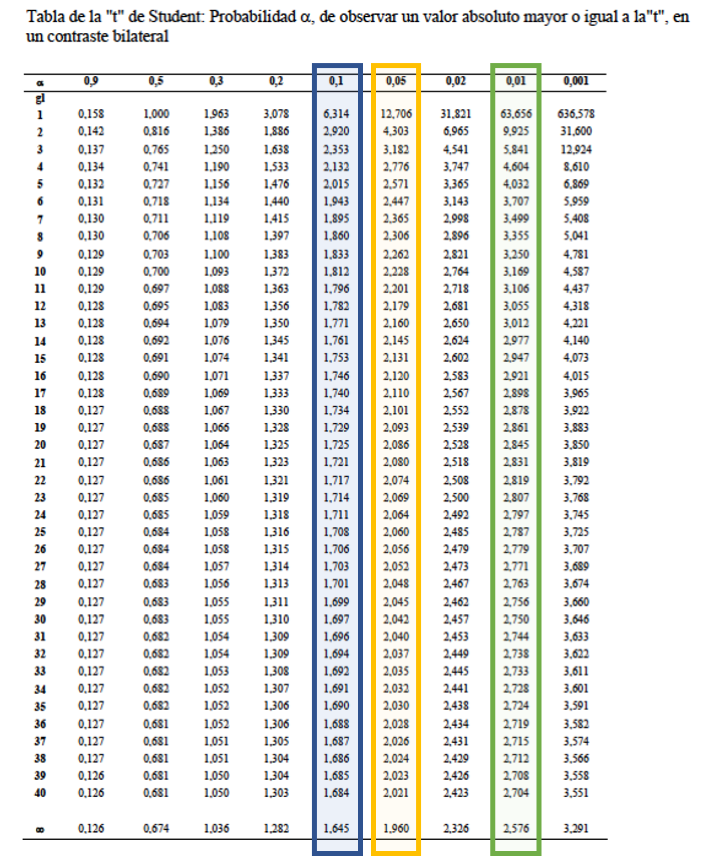

Question
========
```{r data generation, echo = FALSE, results = "hide", comment=FALSE}
options(OutDec=",")
options(scipen=999)

xn <- sample(seq(18, 32), 1)
xmean <- sample(seq(7.5, 8.5, 0.1), 1)
xsd <- sample(seq(2.0, 3.12, 0.01), 1)

t90 <- round(qt(1-0.10/2, xn-1, lower.tail = TRUE), 3)
t95 <- round(qt(1-0.05/2, xn-1, lower.tail = TRUE), 3)
t99 <- round(qt(1-0.01/2, xn-1, lower.tail = TRUE), 3)

lo95 <- round(xmean - t95 * xsd/sqrt(xn), 2)
up95 <- round(xmean + t95 * xsd/sqrt(xn), 2)

lo99 <- round(xmean - t99 * xsd/sqrt(xn), 2)
up99 <- round(xmean + t99 * xsd/sqrt(xn), 2)

wlo95 <- round(lo95*0.95, 2)
xlo95 <- round(lo95*0.92, 2)
ylo95 <- round(lo95*0.90, 2)
zlo95 <- round(lo95*0.87, 2)

wup95 <- round(up95*1.05, 2)
xup95 <- round(up95*1.07, 2)
yup95 <- round(up95*1.10, 2)
zup95 <- round(up95*1.12, 2)

wlo99 <- round(lo99*0.95, 2)
xlo99 <- round(lo99*0.92, 2)
ylo99 <- round(lo99*0.90, 2)
zlo99 <- round(lo99*0.87, 2)

wup99 <- round(up99*1.05, 2)
xup99 <- round(up99*1.07, 2)
yup99 <- round(up99*1.10, 2)
zup99 <- round(up99*1.12, 2)
```
En una muestra de `r xn` alumnos se ha observado que el tiempo que destinan, fuera del horario escolar, a realizar trabajos es  = `r xmean` horas/semana, DE = `r xsd` horas/semana. Calcule el intervalo de confianza del 95% i del 99% de esta media.

¿Cuál de las siguientes respuestas es <font size="5"><span style="color: red;"> **CORRECTA**</span></font>?


Answerlist
----------
* IC95% = $\scriptsize \lbrack `r format(lo95, digist=2, nsmall=2)`; `r format(up95, digist=2, nsmall=2)` \rbrack \qquad \qquad \therefore \qquad$ IC99% = $\scriptsize \lbrack `r format(lo99, digist=2, nsmall=2)`; `r format(up99, digist=2, nsmall=2)`\rbrack$

* IC95% = $\scriptsize \lbrack `r format(wlo95, digist=2, nsmall=2)`; `r format(wup95, digist=2, nsmall=2)` \rbrack \qquad \qquad \therefore \qquad$ IC99% = $\scriptsize \lbrack `r format(wlo99, digist=2, nsmall=2)`; `r format(wup99, digist=2, nsmall=2)`\rbrack$

* IC95% = $\scriptsize \lbrack `r format(xlo95, digist=2, nsmall=2)`; `r format(xup95, digist=2, nsmall=2)` \rbrack \qquad \qquad \therefore \qquad$ IC99% = $\scriptsize \lbrack `r format(xlo99, digist=2, nsmall=2)`; `r format(xup99, digist=2, nsmall=2)`\rbrack$

* IC95% = $\scriptsize \lbrack `r format(ylo95, digist=2, nsmall=2)`; `r format(yup95, digist=2, nsmall=2)` \rbrack \qquad \qquad \therefore \qquad$ IC99% = $\scriptsize \lbrack `r format(ylo99, digist=2, nsmall=2)`; `r format(yup99, digist=2, nsmall=2)`\rbrack$

* IC95% = $\scriptsize \lbrack `r format(zlo95, digist=2, nsmall=2)`; `r format(zup95, digist=2, nsmall=2)` \rbrack \qquad \qquad \therefore \qquad$ IC99% = $\scriptsize \lbrack `r format(zlo99, digist=2, nsmall=2)`; `r format(zup99, digist=2, nsmall=2)`\rbrack$


Solution
========
Para estimar un intervalo, que con una confianza predeterminada tenga una alta probabilidad de contener la auténtica media poblacional, se debe aplicar la siguiente fórmula:

${\scriptsize
\begin{eqnarray}
\overline{\text{X}} \pm t_{(\alpha/2)} * \frac{\text{DE}}{\sqrt{\text{n}}}
\end{eqnarray}
}$

Donde 

* $\overline{\text{X}}$ es la media

* $t_{(\alpha/2)}$ es un valor de la distribución *t-Student* (positivo y negativo) que deja en medio el (1-$\alpha$)*100% de los valores posibles y que corresponde a la confianza con la que se va a realizar la estimación, para grados de libertad = n-1.

* DE es la desviación estándar

* n es el tamaño de muestra

En este ejercicio los grados de libertad son $\text{n-1} = `r xn` - 1 = `r xn-1`$. 

Observe que en la tabla de la **Distribución t-*Student* ** que hay más adelante. Se han sombreado algunas columnas:

* La de color <span style="color: blue;">**azul** </span> permite calcular intervalos de confianza del (1 - 0.1) * 100 = 90%
* La de color <span style="color: orange;">**naranja** </span> permite calcular intervalos de confianza del (1 - 0.5) * 100 = 95%
* La de color <span style="color: green;">**verde** </span> permite calcular intervalos de confianza del (1 - 0.01) * 100 = 99%

La fila que debe se debe elegir depende de los grados de libertad que son **n-1**, concretamente `r xn`- 1 = `r xn-1`. Así para calcular

* Intervalos de confianza del 90% el valor que debe elegir de $t_{(\alpha/2)}$ es `r t90`
* Intervalos de confianza del 95% el valor que debe elegir de $t_{(\alpha/2)}$ es `r t95`
* Intervalos de confianza del 99% el valor que debe elegir de $t_{(\alpha/2)}$ es `r t99`


Aplicando la fórmula anterior:
${\scriptsize
\begin{eqnarray}
\overline{\text{X}} \pm t_{(\alpha/2)} * \frac{\text{DE}}{\sqrt{\text{n}}}
\end{eqnarray}
}$

* IC95% = $\scriptsize `r xmean` \pm  `r t95` * \frac{`r xsd`}{\sqrt{`r xn`}} = \lbrack `r format(lo95, digist=2, nsmall=2)`; `r format(up95, digist=2, nsmall=2)`\rbrack$
* IC99% = $\scriptsize `r xmean` \pm  `r t99` * \frac{`r xsd`}{\sqrt{`r xn`}} = \lbrack `r format(lo99, digist=2, nsmall=2)`; `r format(up99, digist=2, nsmall=2)`\rbrack$

Lo que permite afirmar:

* *Se estima con un nivel de confianza del 95% que la media de  tiempo que destinan los alumnos fuera del horario escolar para realizar trabajos es algún valor entre `r format(lo95, digist=2, nsmall=2)` y `r format(up95, digist=2, nsmall=2)` horas/semana.*

* *Se estima con un nivel de confianza del 99% que la media de  tiempo que destinan los alumnos fuera del horario escolar para realizar trabajos es algún valor entre `r format(lo99, digist=2, nsmall=2)` y `r format(up99, digist=2, nsmall=2)` horas/semana.*


Es importante resaltar que comprado con el IC95%, 

* el IC99% tiene **más confianza** (99 $>$ 95)
* és más amplio: 
    * `r format(lo99, digist=2, nsmall=2)` $<$ `r format(lo95, digist=2, nsmall=2)`
    * `r format(up99, digist=2, nsmall=2)` $>$ `r format(up95, digist=2, nsmall=2)`
    * como que es **más amplio**, es **menos preciso**

```{r, echo=FALSE, results='hide'}
include_supplement("t.png")
```

```{r, echo=FALSE, out.width="60%"}

```


Answerlist
----------
* Respuesta CORRECTA
* Respuesta Falsa
* Respuesta Falsa
* Respuesta Falsa
* Respuesta Falsa


Meta-information
================
exname: XXXXX
extype: schoice
exsolution: 10000
exshuffle: 5
