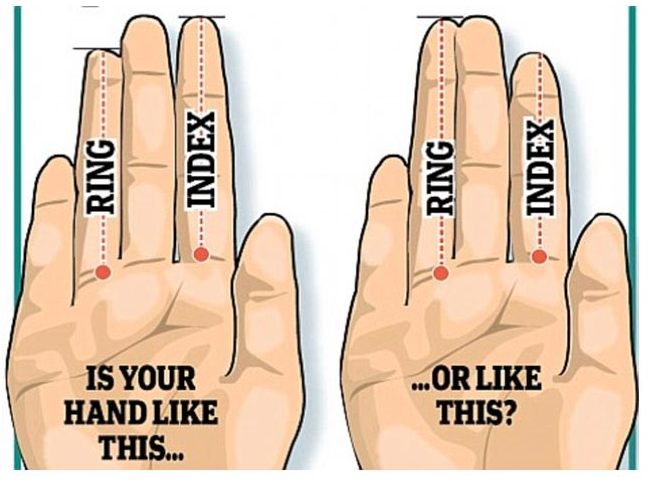

Question
========
```{r data generation, echo = FALSE, results = "hide", comment=FALSE}
options(OutDec=",")
source("/Users/jvila/Dropbox/euit/common/exerc/examsEUIT/simulV02.r")
options(scipen=999)
library(Hmisc)
nmen <- sample(seq(110, 135), 1)
men <- data.frame(Sex= "Male", large=SimCat(nmen, 0.91))
nwom <- sample(seq(136, 165), 1)
wom <- data.frame(Sex= "Female", large=SimCat(nwom, 0.62))
bySex <- rbind(men, wom)

chisqresu <- with(bySex, chisq.test(Sex, large))
tabA <- round(chisqresu$expected, 1)
tabB <- round(chisqresu$observed*1.2, 1)
tabC <- round(chisqresu$expected*1.2, 1)
tabD <- round(chisqresu$expected*0.85, 1)
tabE <- round(chisqresu$observed*0.85, 1)
tables <- sample(c("tabA", "tabB", "tabC", "tabD", "tabE"))
tab1 <- get(tables[1])
tab2 <- get(tables[2])
tab3 <- get(tables[3])
tab4 <- get(tables[4])
tab5 <- get(tables[5])

tabok <- ifelse(sum(tab1==tabA)==4, 1,
      ifelse(sum(tab2==tabA)==4, 2,
      ifelse(sum(tab3==tabA)==4, 3,
      ifelse(sum(tab4==tabA)==4, 4, 
      ifelse(sum(tab5==tabA)==4, 5, NA))))) 
tables <- 1:5
tables <- c(tabok, sample(tables[tables%nin%tabok]))
```

Observe la siguiente figura de dos manos derechas: 

```{r, echo=FALSE, results='hide'}
include_supplement("dits.png")
```

```{r, echo=FALSE, out.width="50%"}

```

En la figura de la izquierda el dedo índice es algo más largo que el anular. En la figura de la derecha el dedo anular es claramente más largo que el dedo índice. 

Se sospecha que una de las características genéticas que diferencia hombres de mujeres se encuentra en los dedos de las manos. Concretamente la mayoría de los hombres tienen el dedo anular más largo que el índice (figura de la derecha), mientras que en la mayoría de mujeres estos dos dedos parece que son igual de largos o el índice más largo (figura de la izquierda). Para comprobar ese supuesto se ha pedido a `r sum(bySex$Sex == "Male")` hombres y `r sum(bySex$Sex == "Female")` mujeres que respondan "sí o no" a la siguiente pregunta ¿Cree que su dedo anular es claramente más largo que su dedo índice? De los hombres han respondido que sí `r sum(bySex$Sex == "Male" & bySex$large==1)` y de las mujeres `r sum(bySex$Sex == "Female" & bySex$large==1)`.

Se ha aplicado la prueba de Ji al cuadrado. Para ello ha debido calcularse la tabla de **valores esperados**. 

A continuación se presentan 5 tablas de **valores esperados**.

-----

<table> 
  <caption>**Tabla esperada número 1**</caption> 
  <tr> 
    <td>&emsp;&emsp;</td> 
    <td colspan="2">**Anular más largo** &emsp; &emsp;</td> 
  </tr> 
  <tr> 
    <td>&emsp;</td> 
    <td>**Sí**</td>
    <td>**No**</td>
  </tr>
  <tr> 
    <td>**Mujeres** &emsp;</td> 
    <td>`r tab1[1]`</td>
    <td>`r tab1[3]`</td>
  </tr>
  <tr> 
    <td>**Hombres** &emsp;</td> 
    <td>`r tab1[2]`</td>
    <td>`r tab1[4]`</td>
  </tr>
</table>

-----

<table> 
  <caption>**Tabla esperada número 2**</caption> 
  <tr> 
    <td>&emsp;&emsp;</td> 
    <td colspan="2">**Anular más largo** &emsp; &emsp;</td> 
  </tr> 
  <tr> 
    <td>&emsp;</td> 
    <td>**Sí**</td>
    <td>**No**</td>
  </tr>
  <tr> 
    <td>**Mujeres** &emsp;</td> 
    <td>`r tab2[1]`</td>
    <td>`r tab2[3]`</td>
  </tr>
  <tr> 
    <td>**Hombres** &emsp;</td> 
    <td>`r tab2[2]`</td>
    <td>`r tab2[4]`</td>
  </tr>
</table>

-----

<table> 
  <caption>**Tabla esperada número 3**</caption> 
  <tr> 
    <td>&emsp;&emsp;</td> 
    <td colspan="2">**Anular más largo** &emsp; &emsp;</td> 
  </tr> 
  <tr> 
    <td>&emsp;</td> 
    <td>**Sí**</td>
    <td>**No**</td>
  </tr>
  <tr> 
    <td>**Mujeres** &emsp;</td> 
    <td>`r tab3[1]`</td>
    <td>`r tab3[3]`</td>
  </tr>
  <tr> 
    <td>**Hombres** &emsp;</td> 
    <td>`r tab3[2]`</td>
    <td>`r tab3[4]`</td>
  </tr>
</table>

-----

<table> 
  <caption>**Tabla esperada número 4**</caption> 
  <tr> 
    <td>&emsp;&emsp;</td> 
    <td colspan="2">**Anular más largo** &emsp; &emsp;</td> 
  </tr> 
  <tr> 
    <td>&emsp;</td> 
    <td>**Sí**</td>
    <td>**No**</td>
  </tr>
  <tr> 
    <td>**Mujeres** &emsp;</td> 
    <td>`r tab4[1]`</td>
    <td>`r tab4[3]`</td>
  </tr>
  <tr> 
    <td>**Hombres** &emsp;</td> 
    <td>`r tab4[2]`</td>
    <td>`r tab4[4]`</td>
  </tr>
</table>

-----

<table> 
  <caption>**Tabla esperada número 5**</caption> 
  <tr> 
    <td>&emsp;&emsp;</td> 
    <td colspan="2">**Anular más largo** &emsp; &emsp;</td> 
  </tr> 
  <tr> 
    <td>&emsp;</td> 
    <td>**Sí**</td>
    <td>**No**</td>
  </tr>
  <tr> 
    <td>**Mujeres** &emsp;</td> 
    <td>`r tab5[1]`</td>
    <td>`r tab5[3]`</td>
  </tr>
  <tr> 
    <td>**Hombres** &emsp;</td> 
    <td>`r tab5[2]`</td>
    <td>`r tab5[4]`</td>
  </tr>
</table>


¿Cuál es la **Tabla Esperada** <font size="5"><span style="color: red;"> **CORRECTA**</span></font>??

Answerlist
----------
* `r paste("Tabla ", tables[1], sep="")`
* `r paste("Tabla ", tables[2], sep="")`
* `r paste("Tabla ", tables[3], sep="")`
* `r paste("Tabla ", tables[4], sep="")`
* `r paste("Tabla ", tables[5], sep="")`


Solution
========
Según los datos proporcionados en este ejercicio, la tabla **observada** es:  

<table> 
  <caption>**Tabla observada**</caption> 
  <tr> 
    <td>&emsp;&emsp;</td> 
    <td colspan="2">**Anular más largo** &emsp; &emsp;</td> 
    <td>&emsp;&emsp;</td> 
  </tr> 
  <tr> 
    <td>&emsp;</td> 
    <td>**Sí**</td>
    <td>**No**</td>
    <td>**TOTAL**</td>
  </tr>
  <tr> 
    <td>**Mujeres** &emsp;</td> 
    <td>`r table(bySex)[1]`</td>
    <td>`r table(bySex)[3]`</td>
    <td>`r table(bySex)[1] + table(bySex)[3]`</td>
  </tr>
  <tr> 
    <td>**Hombres** &emsp;</td> 
    <td>`r table(bySex)[2]`</td>
    <td>`r table(bySex)[4]`</td>
    <td>`r table(bySex)[2] + table(bySex)[4]`</td>
  </tr>
  <tr> 
    <td>**TOTAL** &emsp;</td> 
    <td>`r table(bySex)[1] + table(bySex)[2]`</td>
    <td>`r table(bySex)[3] + table(bySex)[4]`</td>
    <td>`r table(bySex)[1] + table(bySex)[2] + table(bySex)[3] + table(bySex)[4]`</td>
  </tr>
</table>

-----

A partir de la tabla anterior (la tabla "observada") se obtine la **tabla esperada** correcta aplicando los cálculos que se explican a continuación:


<table> 
  <caption>**Tabla esperada**</caption> 
  <tr> 
    <td>&emsp;&emsp;</td> 
    <td colspan="2">&emsp; &emsp;**Anular más largo** &emsp; &emsp;</td> 
  </tr> 
  <tr> 
    <td>&emsp;</td> 
    <td>**Sí**</td>
    <td>&emsp; &emsp;**No**</td>
  </tr>
  <tr> 
    <td>**Mujeres** &emsp;</td> 
    <td>$\scriptsize  \dfrac{`r sum(bySex[, "Sex"] == "Female")`}{`r nrow(bySex)`} \times `r sum(bySex[, "large"] == 1)`$ = `r tabA[1]`&emsp; &emsp;</td>
    <td>&emsp; &emsp;$\scriptsize  \dfrac{`r sum(bySex[, "Sex"] == "Female")`}{`r nrow(bySex)`} \times `r sum(bySex[, "large"] == 2)`$ = `r tabA[3]`</td>
  </tr>
  <tr> 
    <td>&emsp; &emsp;&emsp; &emsp;</td>
    <td>&emsp; &emsp;&emsp; &emsp;</td>
    <td>&emsp; &emsp;&emsp; &emsp;</td>
  </tr>
  <tr> 
    <td>**Hombres** &emsp;</td> 
    <td>$\scriptsize  \dfrac{`r sum(bySex[, "Sex"] == "Male")`}{`r nrow(bySex)`} \times `r sum(bySex[, "large"] == 1)`$ = `r tabA[2]`&emsp; &emsp;</td>
    <td>&emsp; &emsp;$\scriptsize  \dfrac{`r sum(bySex[, "Sex"] == "Male")`}{`r nrow(bySex)`} \times `r sum(bySex[, "large"] == 2)`$ = `r tabA[4]`</td>
  </tr>
</table>


Answerlist
----------
* Respuesta CORRECTA
* Respuesta Falsa
* Respuesta Falsa
* Respuesta Falsa
* Respuesta Falsa


Meta-information
================
exname: XXXXX
extype: schoice
exsolution: 10000
exshuffle: 5
