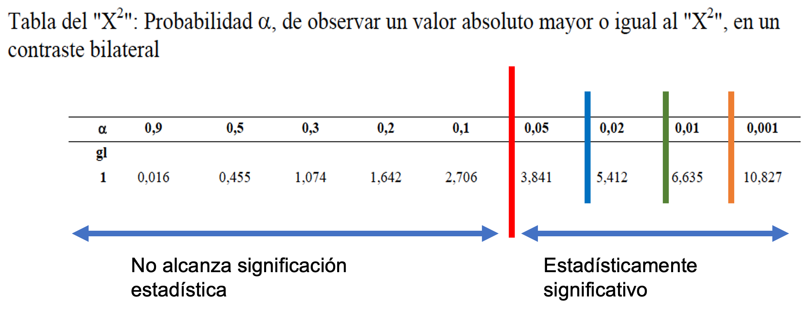

Question
========
```{r data generation, echo = FALSE, results = "hide", comment=FALSE}
options(OutDec=",")
options(scipen=999)

chi <- 12
while (chi >10.7 | chi<3.8 ) {
  nTO <- sample(seq(44,55, 1), 1)
  nCon <- nTO +  sample(seq(-2,2, 1), 1)
  x1 <- rep("Yes", ceiling(nTO*0.51))
  x2 <- rep("No", nTO-length(x1))
  x3 <- rep("Yes", ceiling(nCon*0.2))
  x4 <- rep("No", nCon-length(x3))
  mydat <- data.frame(group = c(rep("Intervention", nTO), rep("Control", nCon)), outcome = c(x1, x2, x3, x4))
  tab <- with(mydat, table(outcome, group))
  resu <- chisq.test(tab)
  pval <- resu$p.value
  chi <- round(resu$statistic, 1)
}
pYes <- (round(prop.table(table(mydat$outcome)), 3)*100)[2]

```
Se realizó un ensayo clínico con `r nrow(mydat)` personas que recibieron el alta hospitalaria tras un primer episodio de ictus con resultado de hemiplejia severa. Se asignaron aleatoriamente `r sum(mydat$group== "Control")` personas a controles habituales por parte de personal médico/enfermería (Grupo Control) y el resto (Grupo Intervención, n=`r sum(mydat$group== "Intervention")`), a los controles habituales se le añadió la atención por parte de profesionales de Terapia Ocupacional. 

A los tres meses se valoró si la persona salía de su domicilio habitualmente o seguía confinada en su domicilio. A los tres meses salían habitualmente del domicilio `r tab[2]` personas del Grupo Control y `r tab[4]` de Grupo Intervención. 

La tabla observada es:

<table> 
  <caption>**Tabla observada**</caption> 
  <tr> 
    <td>&emsp;&emsp;</td> 
    <td colspan="2">**Grupo asignado** &emsp; &emsp;</td> 
    <td>&emsp;&emsp;</td> 
  </tr> 
  <tr> 
    <td>&emsp;</td> 
    <td>**Intervención**</td>
    <td>**Control**</td>
    <td>**TOTAL**</td>
  </tr>
  <tr> 
    <td>**Sale habitualmente** &emsp;</td> 
    <td>`r tab[4]`</td>
    <td>`r tab[2]`</td>
    <td>`r tab[4] + tab[2]`</td>
  </tr>
  <tr> 
    <td>**Confinado** &emsp;</td> 
    <td>`r tab[3]`</td>
    <td>`r tab[1]`</td>
    <td>`r tab[3] + tab[1]`</td>
  </tr>
  <tr> 
    <td>**TOTAL** &emsp;</td> 
    <td>`r tab[3] + tab[4]`</td>
    <td>`r tab[1] + tab[2]`</td>
    <td>`r tab[1] + tab[2] + tab[3] + tab[4]`</td>
  </tr>
</table>

-----


Para aplicar la prueba de Ji al cuadrado se debe calcular los valores esperados bajo ja $H_0$.
Prescindiendo de si la persona es atendida o no por Terapeutas Ocupacionales, a los 3 meses salían habitualmente de su domicilio $\scriptsize \dfrac{`r sum(mydat[, "outcome"] == "Yes")`}{`r nrow(mydat)`} * 100 = `r pYes`\%$ y se quedaban confinados en su domicilio un $\scriptsize 100\% - `r pYes`\% = `r 100-pYes`\%$. 

Si fuera indiferente ser atendido o no por profesionales de Terapia Ocupacional (si la hipótesis nula fuera cierta), se esperaría que a los tres meses salieran habitualmente del domicilio el `r pYes`% de las personas, tanto en el Grupo Control como en el Grupo Intervención. Y complementariamente se esperaría que estuvieran confinadas en su domicilio  `r 100-pYes`%, en cada uno de estos dos grupos.

La siguiente tabla muestra los efectivos esperados bajo la hipótesis nula.

<table> 
  <caption>**Tabla esperada**</caption> 
  <tr> 
    <td>&emsp;&emsp;</td> 
    <td colspan="2">**Grupo asignado** &emsp; &emsp;</td> 
  </tr> 
  <tr> 
    <td>&emsp;</td> 
    <td>**Intervención**</td>
    <td>**Control**</td>
  </tr>
  <tr> 
    <td>**Sale habitualmente** &emsp;</td> 
    <td>`r round(resu$expected, 1)[4]`</td>
    <td>`r round(resu$expected, 1)[2]`</td>
  </tr>
  <tr> 
    <td>**Confinado** &emsp;</td> 
    <td>`r round(resu$expected, 1)[3]`</td>
    <td>`r round(resu$expected, 1)[1]`</td>
  </tr>
  <tr> 
</table>

-----

Se cumplen las condiciones de aplicación<sup>(1)</sup> de la prueba de Ji al cuadrado de Pearson ya que todos los valores esperados son $\geq$ 5.

<h1 style="font-size:10px;"> (1) Si al menos uno de los efectivos esperados fuera $<$ 5, no se cumplirían los criterios de aplicación de la prueba de Ji al cuadrado. Una solución sería aplicar la prueba exacta de Fisher, pero esta prueba no se explica ya que su aplicación está más allá de los objetivos de este curso.</h1>

Con los valores de las dos tablas anteriores (observada y esperada) se ha calculado el valor de $X^2$

${\scriptsize
\begin{eqnarray}
X^2 =   \frac{(`r tab[4]`-`r round(resu$expected, 1)[4]`)^2}{`r round(resu$expected, 1)[4]`} 
\frac{(`r tab[2]`-`r round(resu$expected, 1)[2]`)^2}{`r round(resu$expected, 1)[2]`} 
\frac{(`r tab[3]`-`r round(resu$expected, 1)[3]`)^2}{`r round(resu$expected, 1)[3]`}  
\frac{(`r tab[1]`-`r round(resu$expected, 1)[1]`)^2}{`r round(resu$expected, 1)[1]`}  
= `r round(resu$statistic, 3)` 
\end{eqnarray}
}$

<br>

¿Cuál de las siguientes respuestas es <font size="5">**FALSA**</font>?

Answerlist
----------
* El p-valor es $<$ 0,001
* El porcentaje de personas que a los 3 meses salían habitualmente de su domicilio es significativamente menor que en el Grupo Control
* El porcentaje de personas que a los 3 meses salían habitualmente de su domicilio es significativamente mayor que en el Grupo Intervención
* El valor $X^2$ se debe comparar con la distribución de $X^2$ con un grado de libertad.
* Con un grado de libertad, cualquier valor de $X^2 \geq$ 3,841 se consideraría estadísticamente significativo, estableciendo el punto de corte en el clásico p-valor $\leq$ 0,05


Solution
========
* El p-valor es $<$ 0,001

Esta afirmación es **FALSA**.

Observe la siguiente figura:

```{r, echo=FALSE, results='hide'}
include_supplement("khi.png")
```

```{r, echo=FALSE, out.width="60%"}

```
 
Esta figura muestra la tabla de Ji al cuadrado para un grado de libertad. Los valores de $X^2$ $<$ 3,841 (a la izquierda de la línea vertical roja) se hayan en la zona de **No significación estadística** ya que la probabilidad que la $H_0$ sea cierta es $>$ 0.05

Los valores de $\geq$ 3,841 se hayan en la zona de **significación estadística** de manera que:

* Los valores $\geq$ 10,827 (línea vertical naranja) indican que la probabilidad de la $H_0$ (es decir, el p-valor) es $\leq$ 0.001
* Los valores $\geq$ 6,635 (línea vertical verde) indican que la probabilidad de la $H_0$ (es decir, el p-valor) es $\leq$ 0.01
* Los valores $\geq$ 5,412 (línea vertical azul) indican que la probabilidad de la $H_0$ (es decir, el p-valor) es $\leq$ 0.02
* Los valores $\geq$ 3,841 (línea vertical azul) indican que la probabilidad de la $H_0$ (es decir, el p-valor) es $\leq$ 0.05

El valor $X^2$ obtenido en este ejercicio es de `r round(resu$statistic, 3)`  y por lo tanto no es $\geq$ 10,827, se sitúa antes de la línea vertical naranja y el p-valor NO es $\leq$ 0.001. 

-----

* El porcentaje de personas que a los 3 meses salían habitualmente de su domicilio es significativamente menor que en el Grupo Control

Esta afirmación es cierta ya que el valor de $X^2$ se halla en la zona de significación estadística y el porcentaje de personas que a los 3 meses salían habitualmente de su domicilio en el Grupo Control es  $\scriptsize \dfrac{ `r tab[2]`}{`r tab[2]+ tab[1]`} * 100 = `r round(tab[2]/ (tab[2]+ tab[1])*100, 1)`$%, claramente menor que en el Grupo Intervención donde es $\scriptsize \dfrac{ `r tab[4]`}{`r tab[3]+ tab[4]`} * 100 = `r round(tab[4]/ (tab[3]+ tab[4])*100, 1)`$%.

-----

* El porcentaje de personas que a los 3 meses salían habitualmente de su domicilio es significativamente mayor que en el Grupo Intervención

Esta afirmación es cierta. Ver explicación en la respuesta anterior.

-----

* El valor $X^2$ se debe comparar con la distribución de $X^2$ con un grado de libertad.

Esta afirmación es cierta ya que (Filas-1) * (Columnas-1) = (2-1) * (2-1) = 1.

-----

* Con un grado de libertad, cualquier valor de $X^2 \geq$ 3,841 se consideraría estadísticamente significativo, estableciendo el punto de corte en el clásico p-valor $\leq$ 0,05

Esta afirmación es cierta. Ver la primera explicación.


<br>


Answerlist
----------
* Respuesta FALSA
* Respuesta Correcta
* Respuesta Correcta
* Respuesta Correcta
* Respuesta Correcta


Meta-information
================
exname: XXXXX
extype: schoice
exsolution: 10000
exshuffle: 5
